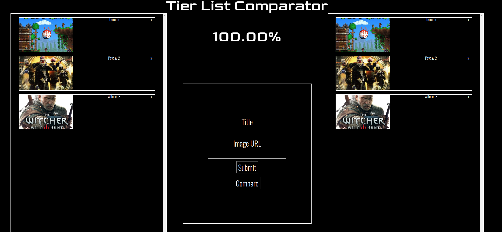
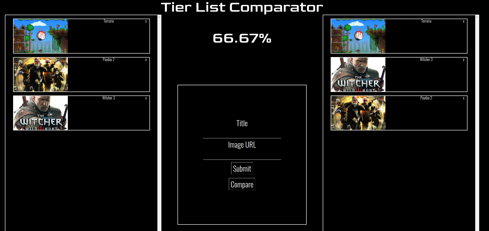

# [Tier List Comparator](https://projeto-de-algoritmos.github.io/D-C_Sam_Luis/)

**Número da Lista**: 4 
**Conteúdo da Disciplina**: D&C 

## Alunos
|Matrícula | Aluno |
| -- | -- |
| 17/0114040  |  Samuel de Souza Buters Pereira |
| 17/0109208  |  Luis Henrique Pereira Taira |

## Sobre 
Tier List Comparator é um comparador de tier lists, comparando as posições dos elementos em ambas e dando um percentual de compatibilidade entre elas em razão do número de inversões.

## Screenshots

## Instalação 
**Linguagem**: Javascript 
### Para rodar localmente:
- Baixe ou clone este repositório;
- Navegue até a raíz do projeto e rode o comando:
> python -m http.server 8080

Ou use qualquer servidor http de sua preferência.

- Em seguida, através de um navegador, acesse o endereço localhost:8080.

Ou [clique aqui](https://projeto-de-algoritmos.github.io/D-C_Sam_Luis/) para acessar o deploy.

## Uso 
- Para adicionar elementos na tier list, insira o título do que deseja adicionar e a URL de uma imagem que represente o mesmo (opcional). Em seguida, pressione Enter ou use o botão Submit.
- Para remover elementos da tier list, clique no X no canto superior direito do elemento em qualquer uma das tier lists.
- Para realizar a comparação a partir das inversões, clique no botão Compare e o resultado aparecerá no centro da tela.

## Outros 
O número de inversões entre as duas tier lists é utilizado para definir a compatibilidade entre elas.